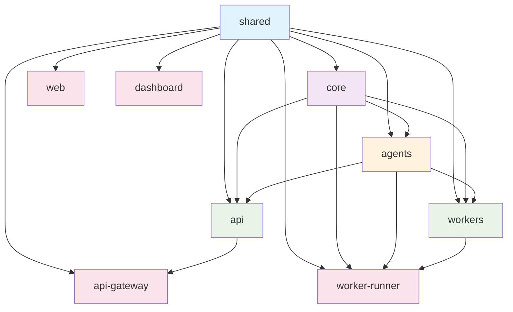
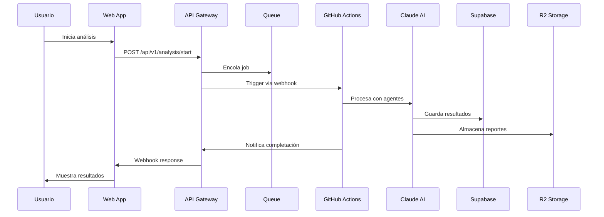

# 📁 Valinor v2 SaaS - Estructura Modular Completa

## 🎯 Vista General

```
valinor-saas/                           # Monorepo raíz
├── 📦 packages/                        # Módulos compartidos
│   ├── shared/                         # Tipos, schemas, utilidades
│   ├── core/                           # Lógica de negocio
│   ├── agents/                         # Claude AI agents
│   ├── api/                            # REST API endpoints
│   ├── workers/                        # Background workers
│   ├── web/                            # Next.js frontend
│   └── infra/                          # Infrastructure as Code
├── 🚀 apps/                            # Aplicaciones deployables
│   ├── api-gateway/                    # Cloudflare Workers gateway
│   ├── worker-runner/                  # GitHub Actions runner
│   └── dashboard/                      # Admin dashboard
├── 🛠️ tools/                           # Herramientas de desarrollo
│   ├── build/                          # Scripts de build
│   └── dev/                            # Utilidades desarrollo
├── 📚 docs/                            # Documentación
├── 🚀 deploy/                          # Configuraciones deploy
└── 📋 scripts/                         # Scripts automatización
```

## 📦 Dependency Graph



## 🏗️ Módulos Detallados

### 📊 @valinor/shared
**Propósito**: Tipos TypeScript, schemas Zod, utilidades compartidas
```typescript
// Exports principales
export * from './types';        // Interfaces y tipos
export * from './schemas';      // Validaciones Zod
export * from './utils';        // Funciones utilitarias
export * from './constants';    // Constantes globales
```
- ✅ **Sin dependencias externas**
- 🎯 **Usado por**: Todos los módulos
- 📝 **Archivos clave**: types/index.ts, schemas/validation.ts

### 🔧 @valinor/core  
**Propósito**: Lógica de negocio, conectores BD, autenticación
```typescript
// Exports principales
export * from './database';     // MySQL, PostgreSQL, MSSQL
export * from './ssh';          // Túneles SSH seguros
export * from './auth';         // JWT, autenticación
export * from './cache';        // Redis caching
```
- 📦 **Dependencias**: @valinor/shared
- 🎯 **Usado por**: agents, api, workers, worker-runner
- 📝 **Archivos clave**: database/connectors.ts, ssh/tunnel.ts

### 🤖 @valinor/agents
**Propósito**: Agentes Claude AI para análisis automatizado
```typescript
// Exports por agente
export * from './cartographer';  // Mapeo de esquemas
export * from './analyst';       // Análisis de datos  
export * from './sentinel';      // Detección anomalías
export * from './hunter';        // Búsqueda patrones
export * from './narrator';      // Generación reportes
export * from './orchestrator';  // Orquestación workflows
```
- 📦 **Dependencias**: @valinor/core, @valinor/shared
- 🎯 **Usado por**: api, workers, worker-runner
- 📝 **Archivos clave**: cada agente en su propia carpeta

### 🌐 @valinor/api
**Propósito**: REST API endpoints y lógica de aplicación
```typescript
// Estructura de endpoints
/api/v1/
├── auth/           // Autenticación
├── clients/        // Gestión clientes
├── analysis/       // Jobs de análisis
├── reports/        // Reportes generados
└── webhooks/       // Webhooks externos
```
- 📦 **Dependencias**: @valinor/core, @valinor/shared, @valinor/agents
- 🎯 **Usado por**: api-gateway
- 📝 **Archivos clave**: routes/, middleware/, controllers/

### ⚙️ @valinor/workers
**Propósito**: Procesadores background y colas
```typescript
// Workers disponibles
export * from './analysis';      // Procesamiento análisis
export * from './report';        // Generación reportes
export * from './notification';  // Envío notificaciones
export * from './cleanup';       // Limpieza datos
```
- 📦 **Dependencias**: @valinor/core, @valinor/shared, @valinor/agents
- 🎯 **Usado por**: worker-runner
- 📝 **Archivos clave**: workers/, queues/, schedulers/

### 💻 @valinor/web  
**Propósito**: Frontend Next.js para usuarios finales
```
pages/
├── dashboard/      // Dashboard principal
├── analysis/       // Gestión análisis
├── reports/        // Visualización reportes
├── settings/       // Configuración usuario
└── auth/           // Autenticación
```
- 📦 **Dependencias**: @valinor/shared
- 🎯 **Deploy**: Vercel
- 📝 **Archivos clave**: pages/, components/, hooks/

### 📊 Dashboard App
**Propósito**: Panel administrativo para gestión interna
```
pages/
├── analytics/      // Métricas y KPIs
├── users/          // Gestión usuarios
├── jobs/           // Monitoreo jobs
├── billing/        // Facturación
└── system/         // Estado sistema
```
- 📦 **Dependencias**: @valinor/shared
- 🎯 **Deploy**: Vercel (puerto 3001)
- 📝 **Archivos clave**: dashboard específico

### 🌩️ API Gateway App
**Propósito**: Gateway Cloudflare Workers para API
```typescript
// Funcionalidades
- Rate limiting por usuario/tier
- Autenticación JWT
- Proxy a servicios internos
- Caching inteligente
- Queue management
```
- 📦 **Dependencias**: @valinor/shared
- 🎯 **Deploy**: Cloudflare Workers
- 📝 **Archivos clave**: src/index.ts, wrangler.toml

### 🏃‍♂️ Worker Runner App
**Propósito**: Ejecutor análisis en GitHub Actions
```typescript
// Flujo de procesamiento
1. Recibe job via webhook
2. Descarga configuración
3. Ejecuta agentes Claude
4. Almacena resultados
5. Notifica completación
```
- 📦 **Dependencias**: @valinor/core, @valinor/agents, @valinor/workers
- 🎯 **Deploy**: GitHub Actions
- 📝 **Archivos clave**: src/index.ts, .github/workflows/

## 🚀 Comandos de Desarrollo

### Setup Inicial
```bash
# Clonar e instalar
git clone https://github.com/valinor/valinor-saas
cd valinor-saas
npm install

# Setup automático
./scripts/dev.sh --install
```

### Desarrollo Local
```bash
# Todos los servicios
npm run dev

# Servicios específicos  
npm run dev --workspace=@valinor/web          # Frontend :3000
npm run dev --workspace=@valinor/dashboard    # Dashboard :3001
npm run dev --workspace=@valinor/api-gateway  # Workers :8787

# Con Docker (base de datos)
docker-compose -f scripts/docker-compose.dev.yml up -d
```

### Testing
```bash
# Tests por módulo
npm run test --workspace=@valinor/core
npm run test --workspace=@valinor/agents

# Tests completos
npm run test              # Unit tests
npm run test:integration  # Integration tests
npm run test:e2e         # E2E tests
```

### Deployment
```bash
# Staging
npm run deploy:staging

# Production  
npm run deploy:production

# Por módulo
npm run deploy:staging --workspace=@valinor/api-gateway
```

## 📊 Escalabilidad por Fases

### Fase 0: MVP (0-3 clientes) - $0/mes
- ✅ GitHub Actions (unlimited)
- ✅ Vercel/Netlify (free)
- ✅ Supabase (free tier)
- ✅ Cloudflare Workers (free)

### Fase 1: Crecimiento (3-10 clientes) - $0-25/mes
- ✅ Automatización completa
- 💰 Supabase Pro ($25) si necesario
- ✅ CF Workers (free tier)

### Fase 2: Escala (10-50 clientes) - $50-100/mes
- 💰 CF Workers Paid ($5)
- 💰 Monitoring ($26)
- ✅ GitHub Actions (aún free)

### Fase 3: Enterprise (50+ clientes) - $200+/mes
- 💰 Full infrastructure
- 💰 Auto-scaling
- 💰 Premium monitoring

## 🔄 Flujo de Datos



## 📋 Checklist de Implementación

### ✅ Estructura Base Completada
- [x] Estructura de carpetas modular
- [x] Package.json para cada módulo
- [x] Dependency graph definido
- [x] Turborepo configurado
- [x] Scripts de desarrollo
- [x] Configuraciones deployment

### 🚧 Próximos Pasos
- [ ] Implementar módulo @valinor/shared completo
- [ ] Migrar agentes desde Valinor v0
- [ ] Configurar API gateway básico
- [ ] Setup inicial de frontend Next.js
- [ ] Configurar CI/CD pipeline
- [ ] Tests de integración

### 🎯 Objetivos a 30 días
- [ ] MVP funcional con 1 cliente
- [ ] Pipeline CI/CD operativo  
- [ ] Documentación completa
- [ ] Primeras demos exitosas

Esta estructura modular permite desarrollo independiente, testing granular, deployment selectivo y escalabilidad tanto horizontal como vertical, manteniendo los costos en $0 durante las fases iniciales.