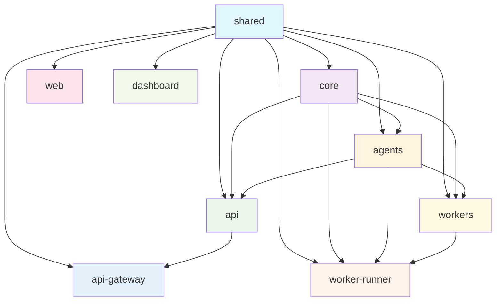
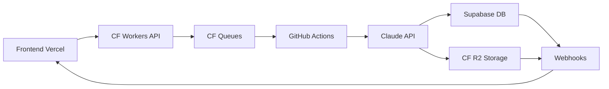

# 🏗️ Valinor v2 SaaS - Arquitectura Modular

## 📊 Dependency Graph



## 🎯 Módulos Core

### @valinor/shared
- **Propósito**: Tipos compartidos, schemas Zod, utilidades
- **Dependencias**: Ninguna
- **Usado por**: Todos los módulos
- **Exports**:
  - `/types` - Interfaces TypeScript
  - `/schemas` - Validaciones Zod
  - `/utils` - Funciones utilitarias

### @valinor/core
- **Propósito**: Lógica de negocio, conectores de BD, autenticación
- **Dependencias**: @valinor/shared
- **Usado por**: agents, api, workers, worker-runner
- **Exports**:
  - `/database` - Conectores MySQL, PostgreSQL, SQL Server
  - `/ssh` - Túneles SSH seguros
  - `/auth` - Autenticación JWT

### @valinor/agents
- **Propósito**: Agentes Claude AI para análisis
- **Dependencias**: @valinor/core, @valinor/shared
- **Usado por**: api, workers, worker-runner
- **Exports**:
  - `/cartographer` - Mapeo de esquemas
  - `/analyst` - Análisis de datos
  - `/sentinel` - Detección de anomalías
  - `/hunter` - Búsqueda de patrones
  - `/narrator` - Generación de reportes
  - `/orchestrator` - Orquestación de workflows

## 🚀 API Design

### REST vs tRPC vs GraphQL

**Decisión: REST + tRPC híbrido**

```typescript
// REST para operaciones CRUD simples
GET /api/v1/clients
POST /api/v1/analysis/start
GET /api/v1/reports/{id}

// tRPC para operaciones complejas con type safety
const trpc = createTRPCNext<AppRouter>({
  config({ ctx }) {
    return {
      transformer: superjson,
      links: [
        httpBatchLink({
          url: '/api/trpc',
        }),
      ],
    };
  },
});

// Uso en frontend
const { data, isLoading } = trpc.analysis.getResults.useQuery({
  analysisId: 'abc123'
});
```

### Endpoint Structure

```
/api/v1/
├── auth/
│   ├── POST /login
│   ├── POST /register  
│   ├── POST /refresh
│   └── POST /logout
├── clients/
│   ├── GET /
│   ├── POST /
│   ├── GET /{id}
│   ├── PUT /{id}
│   └── DELETE /{id}
├── analysis/
│   ├── POST /start
│   ├── GET /{id}/status
│   ├── GET /{id}/results
│   └── DELETE /{id}
├── reports/
│   ├── GET /
│   ├── GET /{id}
│   ├── GET /{id}/download
│   └── DELETE /{id}
└── webhooks/
    ├── POST /github
    ├── POST /supabase
    └── POST /stripe
```

### Rate Limiting Strategy

```typescript
// Cloudflare Workers
const rateLimiter = {
  free: '10/minute',      // Free tier
  pro: '100/minute',      // Pro users  
  enterprise: '1000/minute' // Enterprise
};

// Implementation
export default {
  async fetch(request, env, ctx) {
    const userId = await getUserFromToken(request);
    const tier = await getUserTier(userId);
    
    const isAllowed = await checkRateLimit(
      userId, 
      rateLimiter[tier]
    );
    
    if (!isAllowed) {
      return new Response('Rate limit exceeded', { status: 429 });
    }
    
    return handleRequest(request, env, ctx);
  }
};
```

## 🔄 Development Workflow

### Monorepo con Turborepo

```json
{
  "pipeline": {
    "build": {
      "dependsOn": ["^build"],
      "outputs": [".next/**", "dist/**", ".wrangler/**"]
    },
    "dev": {
      "cache": false,
      "persistent": true
    },
    "test": {
      "dependsOn": ["build"],
      "outputs": ["coverage/**"]
    }
  }
}
```

### Local Development

```bash
# Setup inicial
npm install
npm run build

# Desarrollo completo
npm run dev
# Inicia:
# - Next.js en localhost:3000 (web)
# - Next.js en localhost:3001 (dashboard)  
# - API en localhost:4000
# - Wrangler dev en localhost:8787 (workers)

# Desarrollo por módulo
npm run dev --workspace=@valinor/web
npm run dev --workspace=@valinor/api-gateway
```

### Testing Strategy

```typescript
// Unit Tests - Vitest
describe('Database Connector', () => {
  it('should connect to MySQL', async () => {
    const db = new MySQLConnector(config);
    await expect(db.connect()).resolves.toBeDefined();
  });
});

// Integration Tests
describe('Analysis API', () => {
  it('should start analysis job', async () => {
    const response = await request(app)
      .post('/api/v1/analysis/start')
      .send({ connectionString: 'mysql://...' });
    
    expect(response.status).toBe(200);
    expect(response.body.jobId).toBeDefined();
  });
});

// E2E Tests - Playwright
test('complete analysis workflow', async ({ page }) => {
  await page.goto('/dashboard');
  await page.click('[data-testid="start-analysis"]');
  await page.fill('[data-testid="connection-string"]', 'mysql://...');
  await page.click('[data-testid="submit"]');
  
  await expect(page.locator('[data-testid="job-status"]'))
    .toContainText('Processing');
});
```

## 🚀 Deployment Architecture

### Zero-Cost Deployment (0-10 clientes)



### Cloudflare Workers Deployment

```typescript
// wrangler.toml
[env.staging]
name = "valinor-api-staging"
compatibility_date = "2023-12-01"

[env.production]  
name = "valinor-api-production"
compatibility_date = "2023-12-01"

[[env.production.kv_namespaces]]
binding = "CACHE"
id = "xxx"

[[env.production.r2_buckets]]
binding = "STORAGE" 
bucket_name = "valinor-reports"
```

### GitHub Actions CI/CD

```yaml
name: Deploy Valinor SaaS
on:
  push:
    branches: [main]
  pull_request:
    branches: [main]

jobs:
  test:
    runs-on: ubuntu-latest
    steps:
      - uses: actions/checkout@v4
      - uses: actions/setup-node@v4
        with:
          node-version: '18'
          cache: 'npm'
      
      - run: npm ci
      - run: npm run build
      - run: npm run test
      - run: npm run test:integration

  deploy-staging:
    needs: test
    if: github.ref == 'refs/heads/main'
    runs-on: ubuntu-latest
    steps:
      - uses: actions/checkout@v4
      - run: npm ci
      - run: npm run deploy:staging
        env:
          CLOUDFLARE_API_TOKEN: ${{ secrets.CLOUDFLARE_API_TOKEN }}
          SUPABASE_URL: ${{ secrets.SUPABASE_URL }}
          SUPABASE_ANON_KEY: ${{ secrets.SUPABASE_ANON_KEY }}

  deploy-production:
    needs: test
    if: startsWith(github.ref, 'refs/tags/v')
    runs-on: ubuntu-latest
    steps:
      - uses: actions/checkout@v4
      - run: npm ci
      - run: npm run deploy:production
```

## 🔒 Security & Monitoring

### Secrets Management

```typescript
// Environment Variables por entorno
interface EnvVars {
  ANTHROPIC_API_KEY: string;
  SUPABASE_URL: string;
  SUPABASE_SERVICE_KEY: string;
  JWT_SECRET: string;
  GITHUB_TOKEN: string;
  STRIPE_SECRET_KEY: string;
}

// Cloudflare Workers Secrets
wrangler secret put ANTHROPIC_API_KEY --env production
wrangler secret put SUPABASE_SERVICE_KEY --env production
```

### Monitoring Stack

```typescript
// Free Tier Monitoring
const monitoring = {
  uptime: 'UptimeRobot (free)',
  errors: 'Sentry (free tier)',
  analytics: 'Vercel Analytics (free)',
  logs: 'Cloudflare Workers Logs (free)',
  metrics: 'Custom dashboard in Next.js'
};
```

## 📈 Escalability Plan

### Phase 0: MVP (0-3 clients) - $0/mes
- Manual processes
- Basic automation
- GitHub Actions unlimited

### Phase 1: Growth (3-10 clients) - $0-25/mes  
- Full automation
- Supabase Pro if needed
- CF Workers free tier

### Phase 2: Scale (10-50 clients) - $50-100/mes
- Paid CF Workers
- Enhanced monitoring
- Premium support

### Phase 3: Enterprise (50+ clients) - $200+/mes
- Multi-region deployment
- Advanced observability
- Auto-scaling infrastructure

## 🎯 Migration Strategy

### From Valinor v0 to v2

```bash
# 1. Mantener v0 funcionando
cd valinor-v0
python run_cartographer.py # Continúa funcionando

# 2. Migrar gradualmente
cd valinor-saas
npm run migrate:agents    # Migra agentes primero
npm run migrate:config    # Migra configuraciones
npm run migrate:data      # Migra datos históricos

# 3. A/B testing
npm run deploy:staging    # Deploy v2 en staging
# Comparar resultados v0 vs v2

# 4. Switch completo
npm run deploy:production # v2 a producción
npm run retire:v0        # Deprecar v0
```

Esta arquitectura modular permite:
- **Desarrollo independiente** de cada módulo
- **Testing granular** por componente  
- **Deployment selectivo** por entorno
- **Escalability** horizontal y vertical
- **Mantenimiento** simplificado
- **Zero-cost** en fases tempranas